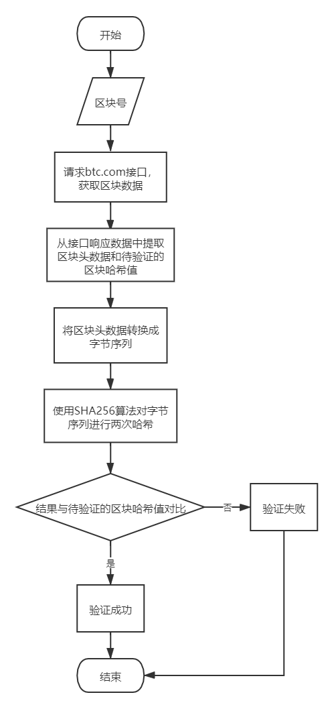

# blockhash_verify

## 说明

根据区块号，从`btc.com`网站接口获取区块数据，并验证区块哈希值是否正确。

## 快速开始

基于Windows。

编译：

```cmd
go build .
```

在当前目录下生成`blockhash_verify.exe`可执行程序。

传入区块号，验证区块哈希：

```cmd
blockhash_verify.exe -height <区块号>
```

示例：

```cmd
> blockhash_verify.exe -height 0
验证第0个区块中......
区块头信息：
+++++++++++++++++++++++++++++++
version:00000001
prevBlockHash:0000000000000000000000000000000000000000000000000000000000000000
merkleRoot:4A5E1E4BAAB89F3A32518A88C31BC87F618F76673E2CC77AB2127B7AFDEDA33B
time:495FAB29
bits:1D00FFFF
nonce:7C2BAC1D
+++++++++++++++++++++++++++++++
区块哈希值：000000000019D6689C085AE165831E934FF763AE46A2A6C172B3F1B60A8CE26F
区块头字节序(小端)：0100000000000000000000000000000000000000000000000000000000000000000000003BA3EDFD7A7B12B27AC72C3E67768F617FC81BC3888A51323A9FB8AA4B1E5E4A29AB5F4
9FFFF001D1DAC2B7C
计算的区块哈希值：000000000019D6689C085AE165831E934FF763AE46A2A6C172B3F1B60A8CE26F
验证成功！
```

## 重要算法说明

算法输入：

- 区块号

算法输出：

- 验证结果，成功或者失败

算法步骤：

1. 根据区块号，请求`btc.com`接口，获取区块数据。
2. 从接口响应数据中提取区块头数据，区块头结构如下：
```go
type blockHeader struct {
    version       [4]byte  // 版本号
    prevBlockHash [32]byte // 前一个区块的哈希
    merkleRoot    [32]byte // 该区块中交易的merkle树根的哈希值
    time          [4]byte  // 该区块的创建时间戳
    bits          [4]byte  // 该区块工作量证明难度目标
    nonce         [4]byte  // 用于证明工作量的计算随机数
}
```
3. 从接口响应数据中提取待验证的区块哈希值。
4. 将区块头数据转换成字节序列，各字段呈小端模式。
5. 使用`SHA256`算法对字节序列进行两次哈希，得到区块哈希值。
6. 与待验证的区块哈希值做对比，若相同则验证成功，不同而验证失败。

算法流程图：


